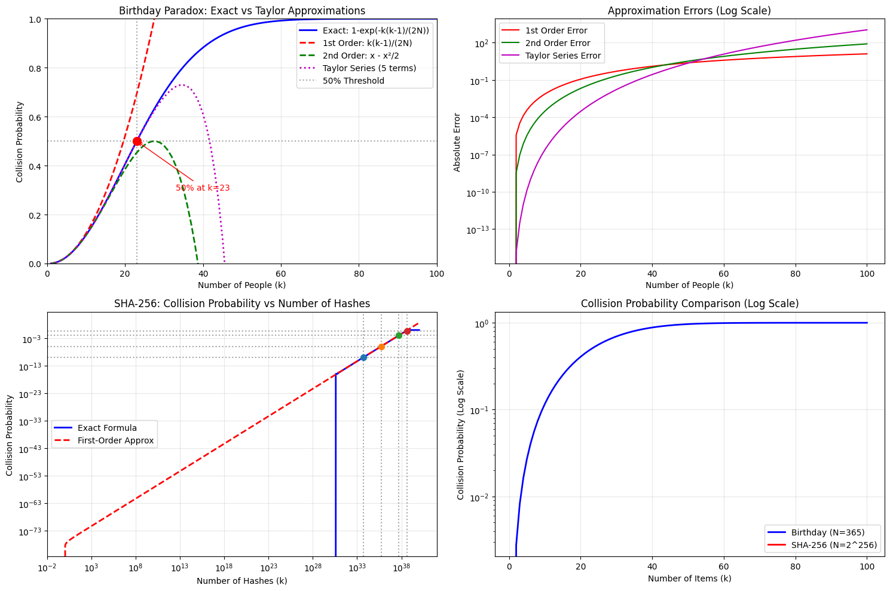
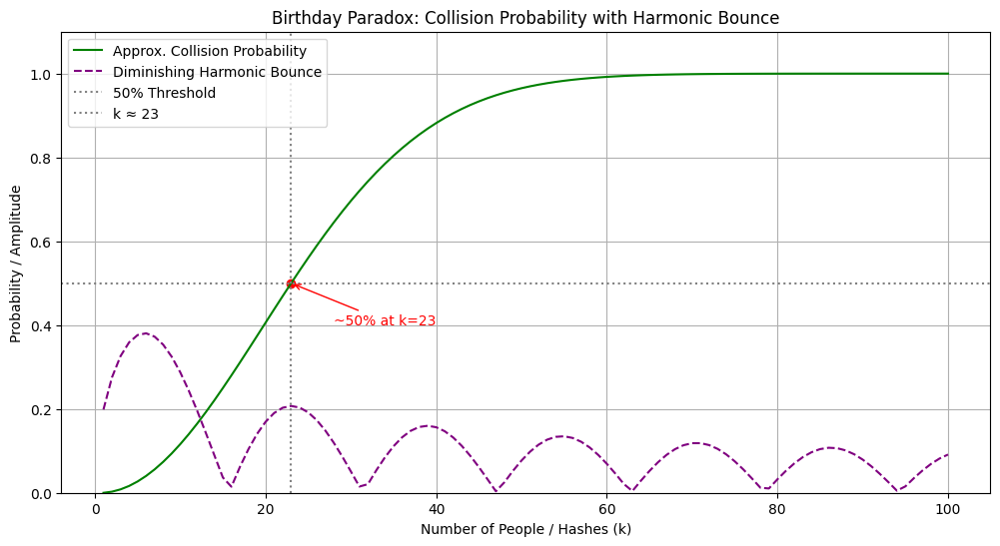
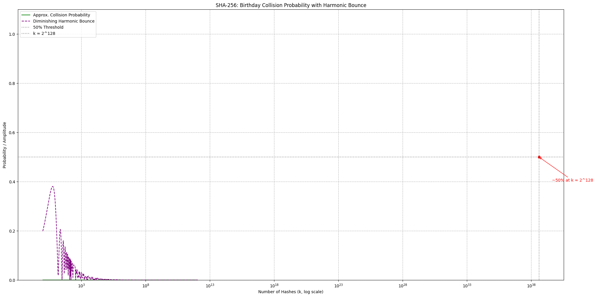
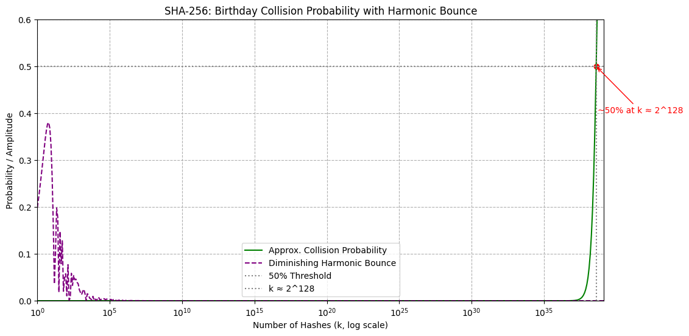

# 📘 Birthday Paradox and Harmonic Bounce

On the Birthday Paradox and how it relates to harmonics, and then plot a harmonic graph (bouncing ball style) that intuitively visualizes the probability growth curve.

The Birthday Paradox refers to the counterintuitive probability that in a group of just 23 people, there's a > 50% chance that at least 2 share the same birthday.

Let:
- 𝑁: number of possible birthdays (or hash outputs) → e.g., 365 days or $$/ 2^256 /$$ for SHA-256.
- 𝑘: number of samples (people/hashes).
- 𝑃(𝑘;𝑁): probability of no collision after 𝑘 samples:

\[
P(k; N) = \prod_{i=0}^{k-1} \left(1 - \frac{i}{N}\right)
\]

The probability of **at least one collision**:

\[
P_{\text{collision}}(k; N) = 1 - \prod_{i=0}^{k-1} \left(1 - \frac{i}{N}\right)
\]

---

## ⚡ Taylor Approximation

For large \( N \), we use a Taylor approximation:

\[
P_{\text{collision}}(k; N) \approx 1 - e^{-\frac{k(k-1)}{2N}}
\]

For \( N = 365 \), the probability exceeds **50%** at:

\[
k \approx 23
\]

---

## 🔁 Diminishing Harmonic Bounce

To simulate a “bouncing ball” decay effect, we define:

\[
\text{bounce}(k) = |\sin(k / 5)| \cdot \frac{1}{\sqrt{k}}
\]

This is illustrative only and does **not** reflect real collision probability—it’s used for visualizing intuition fluctuation as probability grows.

## 🔐 SHA-256 and the Birthday Bound

For a cryptographic hash function like **SHA-256**, the number of unique outputs is:

\[
N = 2^{256}
\]

To estimate the number of hashes \( k \) needed for a **50% chance of at least one collision**, we use the birthday bound:

\[
P_{\text{collision}}(k; N) \approx 1 - e^{-k^2 / (2N)}
\]

Setting \( P_{\text{collision}} = 0.5 \):

\[
0.5 = 1 - e^{-k^2 / (2N)} \Rightarrow e^{-k^2 / (2N)} = 0.5
\]

\[
-\frac{k^2}{2N} = \ln(0.5) = -\ln(2) \Rightarrow \frac{k^2}{2N} = \ln(2)
\]

\[
k = \sqrt{2N \ln(2)} \approx 1.1774 \cdot \sqrt{N}
\]

### ✅ For SHA-256:

\[
k \approx 1.1774 \cdot \sqrt{2^{256}} = 1.1774 \cdot 2^{128}
\]

\[
k \approx 1.1774 \cdot 3.4 \times 10^{38} \approx 4.0 \times 10^{38}
\]

---

### 🔐 Insight:

- You would need to compute **~\( 2^{128} \)** SHA-256 hashes to reach a 50% probability of collision.
- This number is **astronomically large**, making SHA-256 **collision-resistant** in practical scenarios.

---

## 📈 Combined Visualization

The combined plot includes:

- ✅ **Green Line**: Approximate collision probability.
- 🔁 **Purple Dashed Line**: Diminishing harmonic bounce.
- 📍 **Red Dot**: First point where probability exceeds 50% (at \( k \approx 23 \)).
- 🔹 **Gray Lines**: Horizontal (at 50%) and vertical (at \( k = 23 \)) threshold markers.

---
## Mathematical Insights:
- The Taylor series for 1 - e^(-x) is: x - x²/2 + x³/6 - x⁴/24 + ...
- For the birthday paradox, x = k(k-1)/(2N)
- The 50% threshold occurs when k ≈ √(2N ln(2))
- For N=365: ~23 people (code identified this)
- For SHA-256: ~2^128 hashes (practically impossible)

## Key Findings:

- Birthday Paradox: Taylor series works well for small k values but diverges for larger groups
- SHA-256: The collision probability is so astronomically small that even with 100 hashes, it's effectively 0
- Approximation Quality: Higher-order Taylor terms dramatically improve accuracy, especially for larger k values

The visualization shows how the different approximation methods compare and provides insight into when each approach is most appropriate. The SHA-256 analysis demonstrates why cryptographic hash functions are considered secure against collision attacks.

